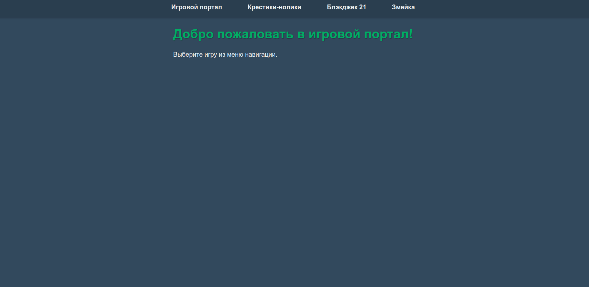

# Игровой портал



Простой игровой портал с тремя классическими играми: Блэкджек, Крестики-нолики и Змейка.

## Особенности

- 🎮 **Три популярные игры** в одном месте
- 🎨 **Единый стиль оформления** для всех игр
- 📱 **Адаптивный дизайн** для мобильных устройств
- ⚡ **Оптимизированная производительность**
- 🕹 **Простое управление**

## Список игр

1. **Blackjack 21** - классическая карточная игра против дилера
2. **Крестики-нолики** - игра для двух игроков на одном устройстве
3. **Змейка** - классическая аркада с нарастающей сложностью

## Технологии

- HTML5
- CSS3 (Flexbox, CSS Variables)
- JavaScript (Canvas API для Змейки)
- Адаптивный дизайн

## Установка

1. Клонируйте репозиторий:
   ```bash
   git clone https://github.com/ваш-username/игровой-портал.git
